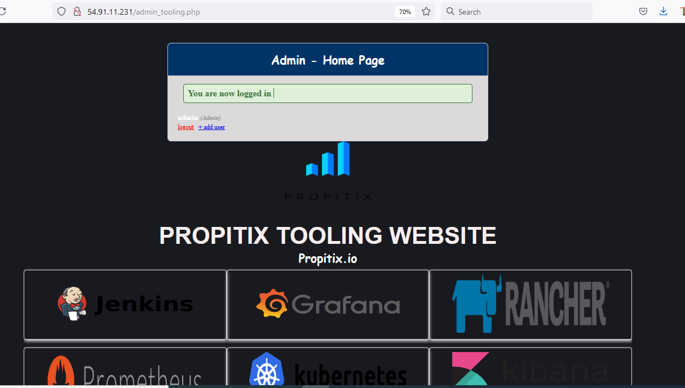
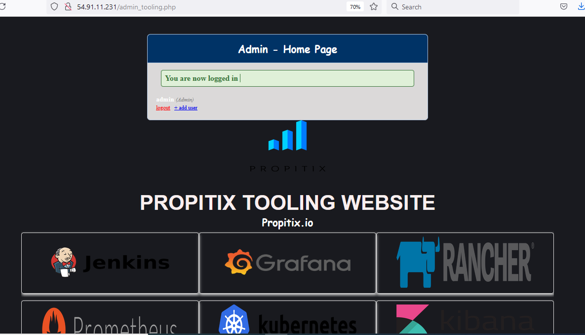

# DEVOPS TOOLING WEBSITE SOLUTION

* This project was carried out using the following components: 
	* NFS server for storage
	* Red Hat Webservers
	* Ubuntu 20.04 database + MySQL
	* PHP programming language
	* GitHub for code repository
	* AWS infrastructure

* The webservers were stateless, able to share a common database and access
  same file using Network File System (NFS.

## Step One - Prepare NFS Server
* Create three logical volumes as lv-apps, lv-logs and lv-opt.
* Mount the logical volumes to /mnt/apps, /mnt/logs and /mnt/opt respectively.
* Install nfs-utils
* Change permissions that will allow webservers to read, write and execute files on NFS 
* Configure access for clients that will access NFS server within same subnet.
* 

## Step Two - Configure Ubuntu 20.04 Database
* Install MySQL server
* Create database: tooling
* Create a database user: webaccess
* Grant full permission to webaccess to do anything only from the webservers subnet cidr.

## Step Three - Configure the Web Servers
* Configure NFS client on the three web servers.
* Deploy a Tooling application to our Web Servers into a shared NFS folder
* Configure the Web Servers to work with a single MySQL database - edit function.php file
* Install Apache
* Verify that NFS is mounted correctly and accessible to web server.
* Locate the log folder for Apache on the Web Server and mount it to NFS server’s export for logs.
* Fork the tooling source code from Darey.io Github Account to your Github account.
* Deploy the tooling website’s code to the Webserver. Ensure that the html folder from the repository is deployed to /var/www/html

## Step Four - Configure PHP on Webservers and set permissions
* Disable SELinus on the web servers.
* Configure PHP
* Update the website’s configuration to connect to the database (in functions.php file). Apply tooling-db.sql script.
* Create in MySQL a new admin user with username: myuser and password: password:
* Open the website in your browser http://<Web-Server-Public-IP-Address-or-Public-DNS-Name>/index.php.

